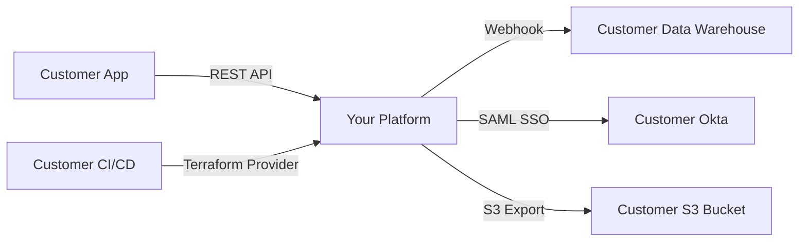
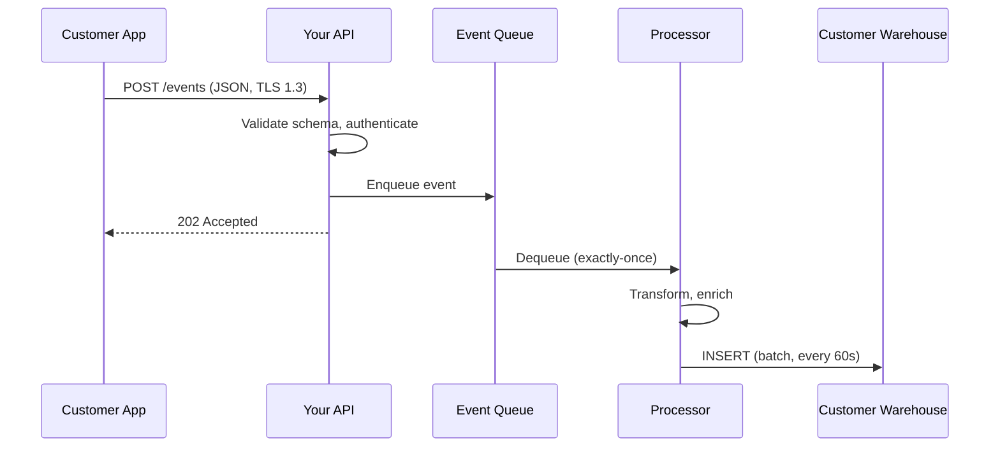
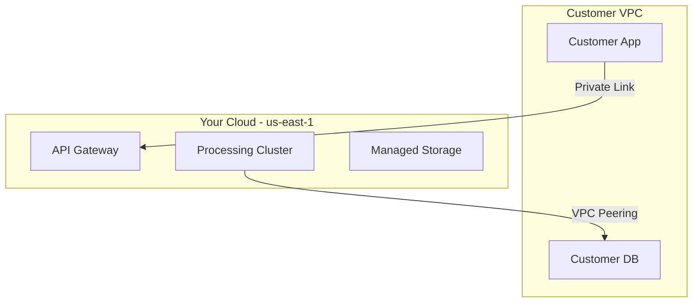

# 02 -- Technical Writing for Customers

SEs write more than they present. Discovery notes, architecture documents, integration guides, executive summaries, RFP responses, follow-up emails -- every deal generates a paper trail that outlives any meeting. The quality of your written artifacts directly affects deal velocity. A clear architecture document shortens the evaluation. A strong executive summary gets budget approval. A well-structured follow-up email keeps momentum. This file covers every document type an SE writes, with templates, structures, and examples.

---

## Architecture Documents

### When and Why to Write Them

You write an architecture document when the customer's technical team needs to understand how your product integrates with their systems. This typically happens:

- After discovery, when you are proposing an integration design
- During POC scoping, to align on what will be built
- Before procurement, when the architecture team needs to approve the solution
- For security review, when InfoSec needs to understand data flows

The audience is the customer's technical team: architects, senior engineers, DevOps, and sometimes InfoSec. They will use this document to evaluate your product, plan the integration, and get internal approval.

### Architecture Document Structure

```
1. Overview
   - One-paragraph summary of the proposed solution
   - Key business outcomes it enables
   - Scope (what this document covers and what it does not)

2. Component Diagram
   - High-level diagram showing all components
   - Your product, their systems, and the connections between them
   - Include external dependencies (auth providers, cloud services, etc.)

3. Data Flow
   - Step-by-step trace of data from source to destination
   - Include data formats, protocols, and transformation points
   - Call out where data is encrypted, at rest and in transit

4. Integration Points
   - Each connection between your product and their systems
   - API endpoints, authentication methods, data contracts
   - Expected latency and throughput at each point

5. Security and Compliance
   - Authentication and authorization model
   - Data encryption (at rest, in transit, key management)
   - Compliance certifications (SOC 2, HIPAA, GDPR applicability)
   - Network architecture (VPC peering, private endpoints, IP allowlisting)

6. Scaling and Performance
   - Expected load and how the system handles growth
   - Horizontal vs vertical scaling mechanisms
   - Rate limits and throttling behavior
   - SLA commitments

7. Deployment and Operations
   - Deployment model (SaaS, single-tenant, on-prem, hybrid)
   - Monitoring and alerting integration
   - Backup and disaster recovery
   - Upgrade/maintenance windows

8. Appendix
   - API reference links
   - Configuration parameters
   - Glossary of terms
```

### Mermaid Diagram Examples

Mermaid diagrams are ideal for architecture documents because they are version-controllable, renderable in most documentation platforms, and editable by anyone.

**Component diagram:**



**Data flow diagram:**



**Deployment diagram:**



### Writing Tips for Architecture Documents

- **Use their component names, not yours.** If they call their database "the warehouse," you call it "the warehouse."
- **Label every arrow.** An unlabeled arrow on a diagram is a question waiting to be asked.
- **Include failure modes.** "If the webhook delivery fails, events are retried with exponential backoff for 24 hours. After 24 hours, they are moved to a dead-letter queue and an alert is sent."
- **Version the document.** Include a version number, date, and author at the top.
- **Keep it under 10 pages.** If it is longer, split into separate documents (security deep-dive, API reference, etc.).

---

## Integration Guides

Integration guides are step-by-step instructions for connecting your product to the customer's stack. They are more tactical than architecture documents -- less "here's the design" and more "here's how to do it."

### Integration Guide Structure

```
1. Prerequisites
   - Account setup / API key provisioning
   - Required permissions and roles
   - Network requirements (IP allowlisting, VPC peering)
   - Software dependencies and versions

2. Authentication Setup
   - How to generate and configure credentials
   - OAuth flow walkthrough (if applicable)
   - Token refresh and rotation
   - Example: curl command to verify auth works

3. Core Integration Walkthrough
   - Step 1: Install SDK / configure endpoint
   - Step 2: Send first request (with example payload)
   - Step 3: Verify response
   - Step 4: Handle common response codes
   - Step 5: Implement webhook receiver (if applicable)

4. Error Handling
   - Common error codes and what they mean
   - Retry strategy recommendations
   - Rate limit behavior and how to handle 429s
   - Circuit breaker patterns for production

5. Testing
   - Sandbox/staging environment details
   - Test data and fixtures
   - How to verify end-to-end flow
   - Load testing guidelines

6. Production Checklist
   - [ ] Auth credentials rotated from test to production
   - [ ] Error handling and retry logic implemented
   - [ ] Monitoring and alerting configured
   - [ ] Rate limits understood and respected
   - [ ] Webhook endpoint secured (signature verification)
   - [ ] Logging configured (without logging sensitive data)
   - [ ] Rollback plan documented
```

### Example: Partial Integration Guide

```markdown
## 3. Core Integration Walkthrough

### Step 1: Install the SDK

pip install acme-sdk>=2.1.0

### Step 2: Initialize the Client

    from acme import AcmeClient

    client = AcmeClient(
        api_key="your-api-key",
        environment="sandbox",       # Change to "production" when ready
        timeout=30,                   # seconds
        retry_config={"max_retries": 3, "backoff_factor": 0.5}
    )

### Step 3: Send Your First Event

    response = client.events.create(
        event_type="user.signup",
        user_id="usr_12345",
        properties={"plan": "enterprise", "source": "web"},
    )
    print(response.status)   # "accepted"
    print(response.event_id) # "evt_abc123"

### Step 4: Verify in Dashboard

Navigate to https://app.acme.com/events. Your event should appear
within 5 seconds. If it does not, check the troubleshooting section.
```

---

## Executive Summaries

The executive summary is the most important document in many deals. It goes to the person who signs the check. If it is clear and compelling, the deal moves forward. If it is confusing or too technical, the deal stalls.

### The 1-Pager Structure

An executive summary should fit on one page (literally). If it spills to page two, you included too much detail.

```
[Your Company Logo]                    [Date]

EXECUTIVE SUMMARY: [Project/Initiative Name]

THE CHALLENGE
[2-3 sentences describing the business problem in the customer's terms.
No technical jargon. Use their language from discovery calls.]

PROPOSED SOLUTION
[2-3 sentences describing what you propose. Focus on what it does
for them, not how it works. One sentence maximum on the mechanism.]

EXPECTED OUTCOMES
- [Outcome 1 with metric]: e.g., "Reduce processing time from 5 days to 4 hours"
- [Outcome 2 with metric]: e.g., "Eliminate $400K/year in manual reconciliation costs"
- [Outcome 3 with metric]: e.g., "Enable real-time reporting for 200+ business users"

TIMELINE
- Phase 1 (Weeks 1-2): [Integration and configuration]
- Phase 2 (Weeks 3-4): [Pilot with one team/workflow]
- Phase 3 (Weeks 5-8): [Full rollout]

INVESTMENT
[Pricing at the level of detail appropriate for the stage.
Early stage: "Starting at $X/year." Late stage: exact quote.]

NEXT STEPS
1. [Specific action, owner, date]
2. [Specific action, owner, date]
3. [Specific action, owner, date]
```

### What to Include and What to Leave Out

| Include | Leave Out |
|---|---|
| Business problem in their words | Technical architecture details |
| Quantified outcomes | Feature lists |
| Timeline with phases | Implementation specifications |
| Investment range or quote | Pricing breakdowns by feature |
| Clear next steps with owners | Open questions or uncertainties |
| Customer proof points (1-2) | Your company history |
| Risk mitigation (if asked) | Caveats and disclaimers (save for technical docs) |

### Avoiding Technical Jargon

Every technical term has a business equivalent. Use the business version in executive summaries:

| Technical Term | Business Translation |
|---|---|
| API integration | Automated data connection |
| Webhook | Real-time notification |
| SSO / SAML | Single login with existing credentials |
| Microservices | Modular, independently scalable components |
| Kubernetes | Cloud infrastructure management |
| ETL pipeline | Automated data processing |
| 99.99% uptime | Less than 1 hour of downtime per year |
| Horizontal scaling | Handles more volume without changes |
| Idempotent | Processes each item exactly once, even if retried |

---

## RFP/RFI Responses

### What RFPs Are and How They Work

**RFP** (Request for Proposal) -- a formal document from a prospective customer asking vendors to propose a solution. Common in enterprise, government, and regulated industries. Typically includes:

- Company background and project scope
- Detailed technical and business requirements (often 50-500 questions)
- Evaluation criteria and weighting
- Timeline for submission, evaluation, and decision
- Legal and compliance requirements

**RFI** (Request for Information) -- a lighter version of an RFP, used when the customer is still exploring options. Less formal, fewer requirements, more about understanding what is available.

### The SE's Role in RFPs

The SE owns the technical sections of the RFP response. This typically means:

1. Reading and interpreting all technical requirements
2. Assessing product fit for each requirement
3. Writing honest, detailed responses
4. Coordinating with PM/Engineering on roadmap items
5. Building the compliance matrix
6. Reviewing the complete response for technical accuracy

### The Compliance Matrix

The compliance matrix is the core deliverable. It maps every requirement to a response status:

| Status | Symbol | Meaning |
|---|---|---|
| Fully Supported | F | Product supports this today, out of the box |
| Partially Supported | P | Supported with configuration, customization, or workaround |
| Roadmap | R | Planned for a specific release (must include timeline) |
| Partner/Integration | I | Supported through a certified integration or partner |
| Not Supported | N | Not available and not planned |

**Example compliance matrix:**

| Req # | Requirement | Status | Response |
|---|---|---|---|
| T-001 | Must support SAML 2.0 SSO | F | Native SAML 2.0 support with metadata exchange. Supports Okta, Azure AD, OneLogin, and custom SAML IdPs. |
| T-002 | Must provide real-time event streaming | F | Event streaming via webhooks with configurable retry. Also supports Kafka and Amazon EventBridge delivery. |
| T-003 | Must support on-premises deployment | P | Available as a containerized deployment (Docker/K8s). Requires customer-provided infrastructure. Full SaaS recommended. |
| T-004 | Must integrate with SAP ERP | R | SAP connector planned for Q3 2026. Currently supported via REST API with custom middleware. |
| T-005 | Must support air-gapped environments | N | Not supported. Product requires outbound internet for license validation and updates. |

### How to Answer "Does Your Product Support X?" Honestly

The temptation is to always say yes. Resist it. The best RFP responses build trust through honesty:

- **If fully supported:** State it clearly with specifics. "Yes. Our platform provides native SAML 2.0 integration with one-click configuration for major IdPs."
- **If partially supported:** Explain what works and what requires additional effort. "Our platform supports custom field mapping, which covers 80% of this requirement. For the remaining use cases involving nested object transforms, a lightweight middleware layer is needed."
- **If on the roadmap:** Give a timeline and hedge appropriately. "This capability is planned for Q3 2026 (currently in development). We can provide early access for design partnership. Note: roadmap items are subject to change."
- **If not supported:** Say so, and offer an alternative if one exists. "Not supported natively. Customers with this requirement typically use [Partner X] to bridge this gap. We have a documented integration pattern."

Dishonest RFP responses create one of two outcomes: you lose because evaluators catch the dishonesty, or you win and fail during implementation. Both are worse than losing honestly.

### Tips for Winning RFPs

1. **Answer the actual question.** Do not write marketing copy. Evaluators score each answer against specific criteria.
2. **Use the customer's language.** If they say "data lake," you say "data lake" -- not "data lakehouse."
3. **Front-load the answer.** Put the compliance status and key point in the first sentence. Details follow.
4. **Include evidence.** Reference documentation, certifications, case studies.
5. **Differentiate on "partially supported" items.** Many vendors will claim full support -- your honest "partially supported with clear workaround" may score higher.
6. **Collaborate with the AE.** Understand the relationship context. Is this a competitive bake-off or a formality?

---

## Email Communication

Email is the connective tissue of every deal. The right email at the right time keeps momentum. A missing or poorly written email stalls progress.

### The Post-Discovery Follow-Up

Send within 4 hours of the discovery call. Goal: confirm understanding and establish next steps.

```
Subject: [Company] + [Your Company] -- Discovery Follow-Up

Hi [Name],

Thank you for the time today. I want to confirm my understanding of your
current situation and what you're looking for:

Current state:
- [Key point 1 from discovery -- their architecture/process]
- [Key point 2 -- the pain or challenge they described]
- [Key point 3 -- constraints or requirements they mentioned]

Based on this, I think the most valuable next step would be
[demo / technical deep-dive / architecture session] focused on
[specific use case they described].

Proposed agenda for our next session:
1. [Topic A -- mapped to their pain]
2. [Topic B -- mapped to their requirements]
3. Q&A and next steps

Does [Date/Time] work for your team? I'd recommend including
[Role -- e.g., "someone from your data engineering team"] to
get the most out of the technical discussion.

Best,
[Your name]
```

### The Post-Demo Follow-Up

Send within 24 hours. Goal: reinforce what they saw and move toward evaluation.

```
Subject: [Company] Demo Follow-Up -- Next Steps

Hi [Name],

Thanks for joining the demo today. Here's a summary of what we covered
and the action items we discussed:

What we demonstrated:
- [Feature/workflow 1] -- addresses your [specific pain point]
- [Feature/workflow 2] -- shows how [specific outcome] works
- [Feature/workflow 3] -- integration with [their system]

Open questions from the session:
- [Question 1] -- I'm checking with our team and will have an answer
  by [date]
- [Question 2] -- [Answer if you have it, or timeline for answer]

Action items:
- [Your Company]: [Action, owner, by date]
- [Their Company]: [Action, suggested owner, by date]

Attached:
- [Architecture diagram from today's discussion]
- [Link to relevant documentation]

Let me know if I missed anything. Looking forward to [next step].

Best,
[Your name]
```

### The POC Status Update

Send weekly during an active POC. Goal: maintain visibility and momentum.

```
Subject: [Company] POC -- Week [N] Status Update

Hi [Name],

Here's the weekly update on our proof of concept:

Progress this week:
- [Completed milestone 1]
- [Completed milestone 2]
- [In progress: milestone 3 -- expected completion by date]

Success criteria tracker:
| Criteria | Target | Current Status |
|----------|--------|----------------|
| [Criteria 1] | [Target] | [On track / Complete / Blocked] |
| [Criteria 2] | [Target] | [On track / Complete / Blocked] |
| [Criteria 3] | [Target] | [On track / Complete / Blocked] |

Blockers:
- [Blocker 1] -- Need [specific thing] from [person/team] to unblock
  (None if no blockers -- always state this explicitly)

Next week:
- [Planned work 1]
- [Planned work 2]

POC timeline: [X] of [Y] weeks complete. On track for [completion date].

Let me know if you have questions or want to discuss any of this live.

Best,
[Your name]
```

### The "Bad News" Email

Delivering bad news (feature gap, timeline slip, pricing change) via email requires directness and a path forward.

```
Subject: Update on [Specific Topic]

Hi [Name],

I want to give you a transparent update on [topic].

The situation: [State the bad news directly in 1-2 sentences.
Do not bury it or soften it excessively.]

What this means for you: [Explain the impact on their specific
use case or timeline. Be specific.]

What we're doing about it: [Concrete actions, not vague promises.
Include timelines.]

Alternative approach: [If there is a workaround or alternative path,
describe it clearly.]

I know this isn't the update you were hoping for, and I want to make
sure we find the best path forward. Can we schedule 15 minutes to
discuss options?

Best,
[Your name]
```

Key principles for bad news emails:
- **Deliver bad news early.** The longer you wait, the worse the impact.
- **Lead with the news, not the context.** Do not write three paragraphs of setup before the bad news.
- **Own it.** Do not blame other teams, even internally.
- **Offer a path forward.** Bad news without a next step is just bad news.

---

## Internal Documentation

SEs produce internal documentation that makes the team more effective. This is not customer-facing but is critical for deal continuity, knowledge sharing, and team scaling.

### Deal Architecture Documents

When working a complex deal, document the proposed architecture for internal reference. This helps:

- Another SE who inherits the deal
- The CS/implementation team who takes over post-sale
- Leadership who needs to understand deal complexity

Structure: Same as the customer-facing architecture document, plus a section on "Deal Context" that includes competitive dynamics, champion/blocker information, and open risks.

### Knowledge Base Articles

After solving a novel technical challenge, document it for the team:

```
Title: [Short description of the problem/solution]
Customer context: [Industry, stack, use case -- anonymized if needed]
Problem: [What the customer needed]
Solution: [What you built/configured/recommended]
Key learnings: [What would you do differently? What surprised you?]
Reusable artifacts: [Scripts, configs, diagrams that others can use]
```

### Competitive Intelligence Reports

After encountering a competitor in a deal, document what you learned:

```
Competitor: [Name]
Deal context: [Win/loss, customer size, industry]
What they showed: [Features, messaging, pricing you observed]
Where they were strong: [Honest assessment]
Where they were weak: [Honest assessment]
What won/lost the deal: [The decisive factor]
Recommended counter-positioning: [How to position against them next time]
```

### Post-Mortem Documents

After a deal loss or a POC failure, write a post-mortem:

```
Deal: [Customer name, ACV, stage when lost]
What happened: [Factual timeline of the deal]
Root cause: [Technical, competitive, political, pricing, timing]
What we could have done differently: [Actionable lessons]
Product feedback: [Any feature gaps that contributed]
Process feedback: [Any internal process issues]
```

Post-mortems are not blame documents. They are learning documents. The best SE teams share post-mortems openly and use them to improve.

---

## Practice Exercises

The following exercises in `exercises.py` practice concepts from this file:

- **Exercise 2: Executive Summary Writer** -- Takes a technical proposal and generates a 1-page executive summary, stripping jargon and focusing on business impact. Directly applies the "Executive Summaries" template and the jargon translation table above.
- **Exercise 3: Architecture Doc Generator** -- Takes system components, data flows, and integration points, then generates a structured architecture document with Mermaid diagram syntax. Applies the architecture document structure from "Architecture Documents."
- **Exercise 5: RFP Response Builder** -- Takes RFP questions and product capabilities, then generates responses with a compliance matrix. Applies the compliance matrix format and honest response strategies from "RFP/RFI Responses."

See also `examples.py`:
- Section 3: "EXECUTIVE SUMMARY GENERATOR" -- full working implementation that transforms technical input into a business-focused 1-pager.
- Section 4: "TECHNICAL BRIEF TEMPLATE" -- architecture document generator with Mermaid diagram output.
- Section 5: "RFP RESPONSE SYSTEM" -- complete RFP question processor with compliance matrix.

---

## Interview Q&A: Technical Writing for Customers

**Q: Walk me through how you would write an architecture document for a customer's technical team.**

First, I gather inputs from discovery: their current architecture, the integration points we discussed, their security and compliance requirements, and their scale expectations. Then I structure the document starting with a one-paragraph overview that anchors the business problem and proposed solution. Next, I draw the component diagram showing their existing systems and where our product fits -- using their terminology, not ours. The data flow section traces a request end-to-end, calling out protocols, encryption, and transformation points. I include a dedicated security section because that is typically a gate for architecture approval. Scaling and operations sections address "what happens when this grows" and "what does my team need to manage." Throughout, I use Mermaid diagrams for version-controllable visuals. Before sending, I review with my AE for deal context (are there political sensitivities I should address?) and with a technical peer for accuracy. The key principle is that the document should answer every question the customer's architecture review board will ask, so they can approve without scheduling another meeting.

**Q: How do you respond to an RFP requirement when your product only partially meets it?**

Honestly and specifically. I categorize it as "Partially Supported" in the compliance matrix and write a response that states exactly what is supported, what is not, and what the workaround or alternative is. For example: "Our platform supports real-time data sync for structured data natively. For unstructured data (images, PDFs), sync requires a preprocessing step using our transformation API, which adds approximately 5 seconds of latency per item. Documentation for this pattern is available at [link]." This approach builds trust because evaluators are reading dozens of responses and can spot vague hand-waving. If I say "fully supported" and they discover the gap during evaluation, I lose credibility on every other answer. If I say "partially supported" with a clear explanation, they can make an informed decision. I also coordinate with the AE to understand the weight of this specific requirement in the overall evaluation -- if it is a must-have, I will loop in PM to discuss roadmap acceleration. If it is a nice-to-have, the honest partial answer usually suffices.

**Q: Describe your approach to follow-up emails after customer meetings.**

I send follow-up emails within 4 hours for discovery calls and within 24 hours for demos and POC check-ins. Every follow-up has the same structure: what we discussed (confirming my understanding), open questions (with owners and timelines for answers), action items (with specific owners and dates for both sides), and the proposed next step. I always attach relevant artifacts -- architecture diagrams, documentation links, code samples. The key principles are: never leave action items ambiguous (every item has an owner and a date), always confirm understanding in writing (so misalignment surfaces early), and always propose the next meeting with a specific agenda (so momentum continues). For bad news emails, I lead with the news directly, explain the impact on their specific use case, and always offer a path forward. The worst follow-up email is the one that is never sent -- silence after a meeting signals disorganization or disinterest.

**Q: How do you write an executive summary that gets budget approval?**

The executive summary exists to answer one question: "Should I spend this money?" Everything in the document serves that answer. I start with the business problem in the customer's own words (from discovery). Then the proposed solution in one paragraph -- what it does, not how it works. Then the expected outcomes as a bulleted list with specific metrics tied to their KPIs. Timeline with clear phases so they understand the commitment. Investment (pricing) presented simply. And next steps so they know exactly what to do if they say yes. I keep it to one page. I use zero technical jargon -- every term is translated to business language. I include one or two customer proof points to build credibility. And critically, I have the AE review it before it goes out, because they understand the political dynamics of the deal and may know that certain framing resonates better with this particular buyer. The executive summary is not a technical document that got shortened -- it is a business document that happens to be about technology.
