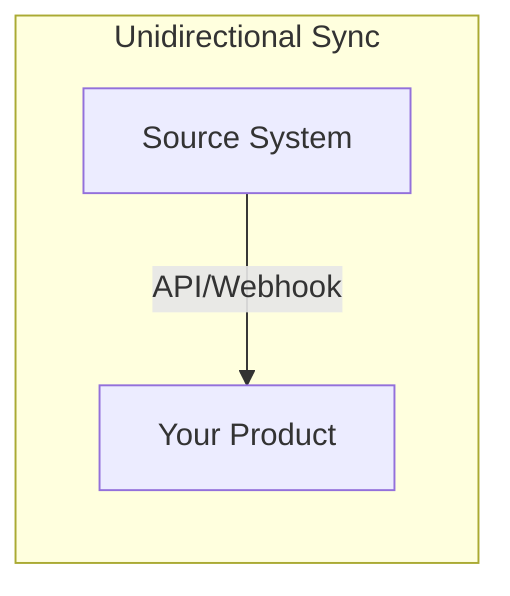
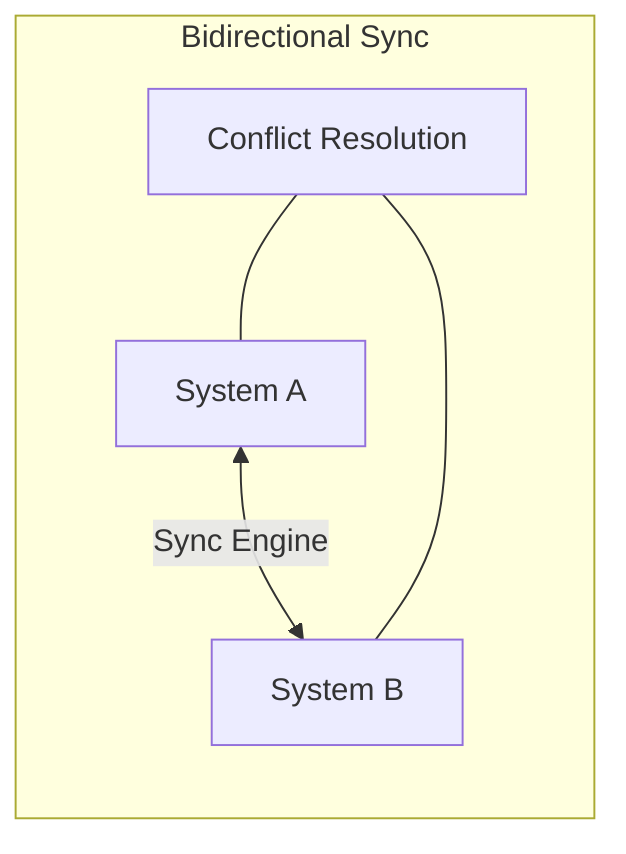
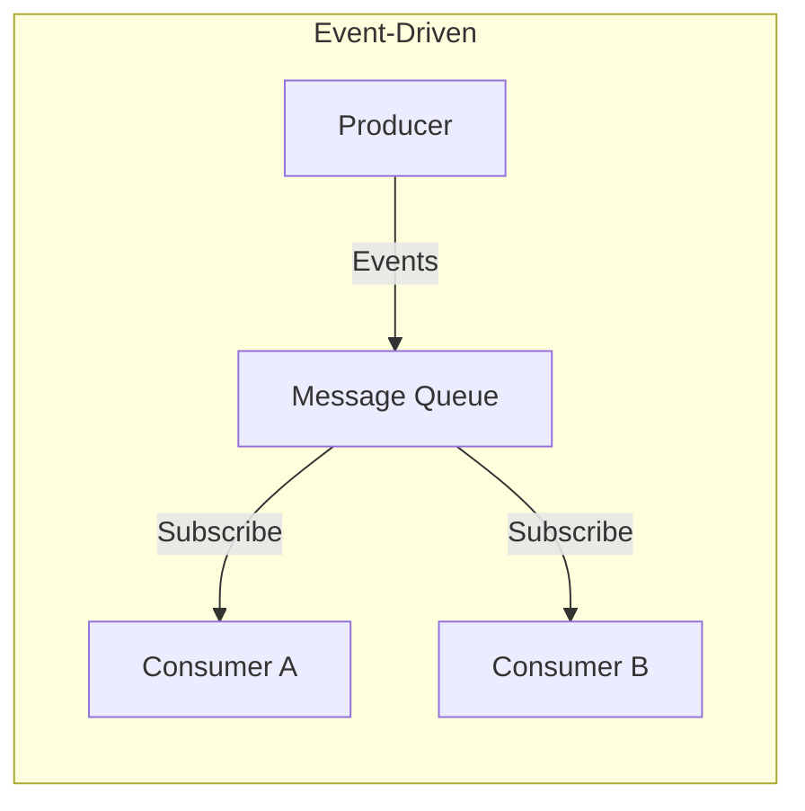
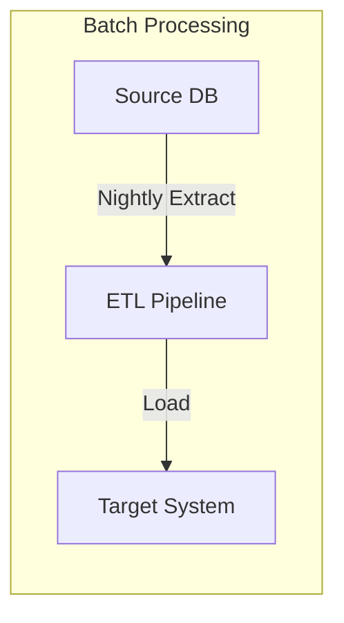

# 01 -- Integration Patterns and Architecture

The SE who can design an integration architecture on a whiteboard and then scope the work realistically is the SE who closes deals. This file covers the patterns you need to recommend, the tradeoffs you need to articulate, and the gotchas you need to warn customers about before they discover them in production.

---

## API Integration Strategies

### REST vs GraphQL vs gRPC

Customers will ask which API style to use. Your recommendation depends on their use case, team skills, and existing infrastructure.

| Dimension | REST | GraphQL | gRPC |
|-----------|------|---------|------|
| **Best for** | CRUD operations, public APIs, broad compatibility | Frontend-driven apps needing flexible queries | Service-to-service, high-throughput, low-latency |
| **Data fetching** | Fixed endpoints, potential over/under-fetching | Client specifies exact fields needed | Strongly typed, efficient binary serialization |
| **Learning curve** | Low — HTTP verbs, JSON, well understood | Moderate — schema language, resolver patterns | Higher — protobuf definitions, code generation |
| **Caching** | HTTP caching works natively (GET, ETags) | Harder — POST-based, need application-level caching | No built-in HTTP caching, custom caching needed |
| **Real-time** | Webhooks or SSE bolt-on | Subscriptions built into spec | Bidirectional streaming native |
| **Tooling** | Postman, curl, universal | Apollo, Relay, graphiql | grpcurl, protobuf toolchains |
| **Customer readiness** | Every team can consume REST | Need frontend team buy-in | Need backend teams comfortable with protobuf |

**SE recommendation framework:**
- **Default to REST** unless there is a specific reason not to. It is universally understood and the customer's team can start immediately.
- **Recommend GraphQL** when the customer has a frontend team that needs to iterate on data requirements without backend changes, or when they are aggregating data from multiple sources.
- **Recommend gRPC** for internal service-to-service communication, especially when latency or throughput matters, or when the customer already uses protobuf.

### API Versioning

Versioning is a conversation you must have early. Customers need to know how your product handles breaking changes.

| Strategy | Format | Pros | Cons |
|----------|--------|------|------|
| **URL path** | `/api/v2/users` | Simple, explicit, easy to route | URL pollution, hard to sunset |
| **Header** | `Accept: application/vnd.api+json;version=2` | Clean URLs, content negotiation | Less discoverable, harder to test |
| **Query param** | `/api/users?version=2` | Easy to test, visible | Can feel hacky, caching complications |

For customer-facing APIs, URL path versioning is the safest recommendation. It is explicit and requires no header manipulation, which matters when customers are testing with curl or Postman.

### Rate Limiting and Throttling

Every integration plan needs a rate limiting strategy. Customers who hit rate limits in production during a demo or POC will lose confidence.

**Standard patterns:**
- **Fixed window**: N requests per minute. Simple, but allows bursts at window boundaries.
- **Sliding window**: N requests in any rolling 60-second period. Smoother, more predictable.
- **Token bucket**: Allows controlled bursting up to a bucket size, then throttles to a steady rate.

**What to communicate to customers:**
1. The exact rate limits (requests per second/minute, tokens per minute for LLM APIs)
2. How limits are scoped (per API key? per user? per organization?)
3. What headers are returned (`X-RateLimit-Remaining`, `X-RateLimit-Reset`)
4. What the response looks like when throttled (429 with `Retry-After`)
5. Whether there are separate limits for different endpoints

### Pagination Strategies

| Strategy | Example | Best for |
|----------|---------|----------|
| **Offset/limit** | `?offset=20&limit=10` | Simple lists, SQL-backed, known total count |
| **Cursor-based** | `?cursor=eyJpZCI6MTAwfQ==` | Large datasets, real-time data, no skipping |
| **Keyset** | `?after_id=100&limit=10` | Time-series data, append-only datasets |

Cursor-based pagination is the default recommendation for any integration that processes large datasets. Offset pagination breaks when records are inserted or deleted during iteration.

### Webhook Delivery Guarantees

Webhooks are the primary mechanism for event-driven integrations. Customers need to understand the delivery guarantees:

- **At-least-once delivery**: The webhook may be sent more than once. The customer's receiver must be idempotent.
- **Ordering**: Webhooks may arrive out of order. Include a timestamp or sequence number.
- **Payload signing**: Sign webhook payloads with HMAC-SHA256 so customers can verify authenticity.
- **Retry policy**: Define the retry schedule (e.g., 5s, 30s, 2m, 15m, 1h, 6h) and maximum retries.

### Scoping an Integration

When a customer asks "how hard is this integration?", you need a framework for answering. Walk through each of these:

1. **Endpoints needed** -- Which API endpoints does the integration touch? List them explicitly.
2. **Data mapping** -- How do fields in their system map to fields in yours? Create a mapping table.
3. **Authentication** -- Which auth pattern is required? Are there service accounts or user-level tokens?
4. **Error handling** -- What happens when a request fails? Retry? Queue? Alert?
5. **Volume and performance** -- How many records? How often? What latency is acceptable?
6. **Monitoring** -- How will both sides know the integration is healthy?

### Integration Architecture Templates









**Decision tree for pattern selection:**

| If the customer needs... | Recommend... |
|--------------------------|-------------|
| Real-time updates, event-driven workflows | Event-driven with webhooks or streaming |
| Periodic bulk data transfer | Batch processing with ETL |
| Two systems staying in sync | Bidirectional sync with conflict resolution |
| One-way data flow, simple | Unidirectional sync via API |
| Low latency, high throughput between services | gRPC streaming or message queue |

---

## Authentication and SSO Patterns

### OAuth 2.0 Flows

OAuth 2.0 is the most common auth pattern you will encounter. Know which flow to recommend:

| Flow | Use Case | Security Level |
|------|----------|---------------|
| **Authorization Code** | Web apps with a backend | High — code exchanged server-side |
| **Authorization Code + PKCE** | SPAs, mobile apps, CLIs | High — no client secret needed |
| **Client Credentials** | Machine-to-machine, service accounts | High — no user involvement |
| **Device Code** | Smart TVs, CLI tools without browsers | Moderate — user authorizes on separate device |

**When to recommend which:**
- **Customer has a web app with a backend**: Authorization Code flow.
- **Customer has a SPA or mobile app**: Authorization Code + PKCE. Never recommend the implicit flow — it is deprecated.
- **Customer needs automated/background integration**: Client Credentials. This is the most common flow for server-to-server integrations.
- **Customer has a CLI tool**: Device Code or Authorization Code + PKCE with localhost redirect.

### SAML for Enterprise SSO

Enterprise customers (500+ employees) will require SAML-based SSO. This is non-negotiable for most enterprise deals.

**Key SAML concepts for SEs:**
- **Identity Provider (IdP)**: The customer's system (Okta, Azure AD, OneLogin, PingFederate)
- **Service Provider (SP)**: Your product
- **SAML Assertion**: The XML document the IdP sends proving the user is authenticated
- **ACS URL**: Where your product receives the SAML assertion
- **Entity ID**: A unique identifier for your product as a service provider
- **Metadata XML**: The configuration document exchanged between IdP and SP

**Common SSO integration pitfalls:**
1. **Clock skew**: SAML assertions have time validity windows. If the IdP and SP clocks are off by more than 5 minutes, assertions fail silently.
2. **Attribute mapping**: The IdP sends user attributes (email, name, groups). Your product needs to map these to its user model. Different IdPs use different attribute names.
3. **Group/role mapping**: Customers want IdP groups to map to roles in your product. This requires configuration on both sides.
4. **JIT provisioning vs SCIM**: Just-in-time provisioning creates users on first login. SCIM provides a full user lifecycle API. Enterprise customers prefer SCIM.

### API Key Management

For simpler integrations, API keys are appropriate. Guide customers on best practices:

- **Rotate keys on a schedule** (90 days minimum)
- **Use different keys for different environments** (dev, staging, production)
- **Never commit keys to source control** (use environment variables or secrets management)
- **Scope keys to minimum required permissions**
- **Set expiration dates** where possible

### JWT Validation Patterns

When your product issues JWTs, customers consuming them need to validate correctly:

```python
# Essential JWT validation checks
def validate_jwt(token: str, config: dict) -> dict:
    """
    Minimum validation every consumer must perform:
    1. Verify signature (RS256 with public key, or HS256 with shared secret)
    2. Check expiration (exp claim)
    3. Check issuer (iss claim matches expected)
    4. Check audience (aud claim matches your service)
    5. Check not-before (nbf claim, if present)
    """
    claims = jwt.decode(
        token,
        key=config["public_key"],
        algorithms=["RS256"],
        audience=config["expected_audience"],
        issuer=config["expected_issuer"],
    )
    return claims
```

---

## Data Migration Strategies

### The Three Approaches

| Approach | Description | Risk | Downtime | Best for |
|----------|-------------|------|----------|----------|
| **Big bang** | Migrate everything at once over a weekend | High — one shot | Hours to days | Small datasets, simple schemas |
| **Phased** | Migrate in stages (by module, team, or data type) | Medium — issues caught early | Minimal per phase | Large orgs, complex data |
| **Parallel run** | Run both systems simultaneously, compare results | Low — full rollback available | Zero | Regulated industries, mission-critical |

**SE recommendation framework:**
- **Big bang** when the dataset is under 1M records, the schema mapping is straightforward, and the customer can tolerate a maintenance window.
- **Phased** when there are multiple data domains, different teams own different data, or the customer wants to validate each phase before proceeding.
- **Parallel run** when the customer cannot afford any data loss, is in a regulated industry, or needs to prove equivalence before cutover.

### Data Mapping and Transformation

Every migration requires a mapping document. Create a table like this:

| Source Field | Source Type | Target Field | Target Type | Transform | Notes |
|-------------|-------------|-------------|-------------|-----------|-------|
| `user.email` | VARCHAR(255) | `account.email_address` | STRING | Lowercase, trim | Primary key |
| `user.created_at` | DATETIME | `account.created_date` | TIMESTAMP | UTC conversion | Source is EST |
| `user.status` | ENUM('A','I','D') | `account.is_active` | BOOLEAN | A=true, else false | Map deleted to inactive |
| `order.amount` | DECIMAL(10,2) | `invoice.total_cents` | INTEGER | Multiply by 100 | Cents, not dollars |

### ETL vs ELT

| | ETL | ELT |
|--|-----|-----|
| **Transform where** | In transit (staging area) | In the target system |
| **Best when** | Target has limited compute, transformations are complex | Target is a data warehouse with strong compute (Snowflake, BigQuery) |
| **Tools** | Airflow, Fivetran, custom scripts | dbt, Snowflake transformations |
| **Customer readiness** | Any team can run ETL scripts | Need analytics/data engineering team |

### Migration Checklists

**Pre-migration:**
- [ ] Complete data mapping document reviewed and approved
- [ ] Source data profiled for quality issues (nulls, duplicates, format inconsistencies)
- [ ] Test migration run on a subset (10%) completed
- [ ] Performance benchmarks established (records per second)
- [ ] Rollback procedure documented and tested
- [ ] Communication plan for affected users drafted
- [ ] Maintenance window scheduled and communicated

**During migration:**
- [ ] Source system set to read-only (if applicable)
- [ ] Migration job started with monitoring dashboard open
- [ ] Progress tracked against expected timeline
- [ ] Error log monitored in real-time
- [ ] Spot checks performed on migrated records

**Post-migration:**
- [ ] Record counts validated (source vs target)
- [ ] Data integrity checks passed (checksums, sample comparison)
- [ ] Application smoke tests passed
- [ ] User acceptance testing completed
- [ ] Rollback window still open (do not close source until validated)
- [ ] Migration retrospective scheduled

### Timeline Estimation

| Dataset Size | Complexity | Estimated Duration |
|-------------|------------|-------------------|
| < 100K records | Simple (1:1 mapping) | 1-2 days |
| 100K - 1M records | Moderate (transforms needed) | 1-2 weeks |
| 1M - 10M records | Complex (multiple sources, custom logic) | 2-4 weeks |
| 10M+ records | Enterprise (regulatory, parallel run) | 1-3 months |

Always add 50% buffer to your estimates. Migrations surface data quality issues that nobody knew existed.

---

## Webhook vs Polling

### When to Recommend Each

| Factor | Webhooks | Polling |
|--------|----------|---------|
| **Latency** | Near real-time (seconds) | Depends on interval (minutes to hours) |
| **Complexity** | Higher (endpoint, security, retry logic) | Lower (cron job, simple HTTP GET) |
| **Customer control** | Less — events push to them | More — they pull when ready |
| **Infrastructure** | Customer needs a publicly accessible endpoint | Customer only needs outbound HTTP |
| **Reliability** | Requires retry/idempotency design | Naturally idempotent (re-fetch same data) |
| **Volume** | Efficient for sparse events | Wasteful if events are rare |

**Decision matrix:**
- **Recommend webhooks** when: events are time-sensitive, the customer has infrastructure to receive HTTP callbacks, and the event rate is unpredictable.
- **Recommend polling** when: the customer cannot expose an endpoint (firewall restrictions), real-time is not required, the customer wants maximum control over when data flows, or they are prototyping.

### Webhook Reliability Patterns

**Retry with exponential backoff:**
```
Attempt 1: Immediate
Attempt 2: 5 seconds
Attempt 3: 30 seconds
Attempt 4: 2 minutes
Attempt 5: 15 minutes
Attempt 6: 1 hour
Attempt 7: 6 hours (final)
```

**Idempotency:** Every webhook payload should include a unique event ID. The customer's receiver should check if it has already processed that event ID before taking action.

**Dead letter queue:** After all retries are exhausted, failed webhooks go to a dead letter queue. The customer (or your support team) can inspect and replay them.

**Payload signing:**
```
Signature = HMAC-SHA256(webhook_secret, request_body)
X-Webhook-Signature: sha256=<hex_digest>
```

The customer verifies the signature before processing. This prevents spoofed webhooks.

### Webhook Payload Design

Good webhook payloads include:
```json
{
    "event_id": "evt_abc123",
    "event_type": "order.completed",
    "timestamp": "2024-01-15T10:30:00Z",
    "api_version": "2024-01-01",
    "data": {
        "order_id": "ord_xyz789",
        "total": 4999,
        "currency": "usd"
    }
}
```

Key design decisions:
- **Thin vs fat payloads**: Thin payloads include only the event type and resource ID (customer fetches details via API). Fat payloads include the full resource. Recommend fat payloads for most use cases — it avoids a follow-up API call.
- **Envelope pattern**: Always wrap the data in an envelope with event metadata (type, timestamp, version).
- **Versioning**: Include the API version in the payload so customers can handle schema changes.

---

## SDK and Client Library Patterns

### When to Provide SDKs vs Raw API Docs

| Factor | Provide SDKs | Raw API Docs Only |
|--------|-------------|-------------------|
| **Customer developer experience** | Faster integration, fewer mistakes | More flexibility, no dependency |
| **API complexity** | Complex auth flows, pagination, retry | Simple CRUD endpoints |
| **Customer base** | Diverse languages and frameworks | Concentrated in 1-2 languages |
| **Maintenance burden** | High — must update with every API change | Low — docs update only |

### SDK Wrapper Patterns

When your product does not have an official SDK for the customer's language, help them build a thin wrapper:

```python
class ProductClient:
    """Thin wrapper around the REST API."""

    def __init__(self, api_key: str, base_url: str = "https://api.product.com/v2"):
        self.base_url = base_url
        self.session = requests.Session()
        self.session.headers.update({
            "Authorization": f"Bearer {api_key}",
            "Content-Type": "application/json",
        })

    def _request(self, method: str, path: str, **kwargs) -> dict:
        response = self.session.request(method, f"{self.base_url}{path}", **kwargs)
        response.raise_for_status()
        return response.json()

    def list_users(self, cursor: str = None, limit: int = 50) -> dict:
        params = {"limit": limit}
        if cursor:
            params["cursor"] = cursor
        return self._request("GET", "/users", params=params)

    def create_user(self, email: str, name: str, role: str = "member") -> dict:
        return self._request("POST", "/users", json={
            "email": email, "name": name, "role": role
        })
```

### Code Generation from OpenAPI

If your product publishes an OpenAPI (Swagger) spec, customers can generate clients automatically:

| Tool | Output | Languages |
|------|--------|-----------|
| **openapi-generator** | Full SDK | 40+ languages |
| **oapi-codegen** | Go client/server | Go |
| **openapi-typescript** | TypeScript types | TypeScript |
| **Kiota** | Microsoft's generator | C#, Go, Java, PHP, Python, Ruby, Swift, TypeScript |

Recommend code generation when the customer needs a language you do not have an official SDK for, and the API surface is large enough to justify it.

---

## Integration Architecture Decision Framework

Use this decision tree when a customer asks "how should we integrate?"

```
1. Is the data flow one-way or two-way?
   ├── One-way → Is it real-time or batch?
   │   ├── Real-time → Webhooks + API
   │   └── Batch → ETL pipeline (nightly/hourly)
   └── Two-way → How do you handle conflicts?
       ├── Last-write-wins → Bidirectional sync with timestamps
       ├── Source-of-truth model → One system is authoritative per field
       └── Manual resolution → Queue conflicts for human review

2. What is the expected volume?
   ├── < 1K events/day → Simple API polling or webhooks
   ├── 1K - 100K events/day → Webhooks with queue (SQS, RabbitMQ)
   └── > 100K events/day → Streaming (Kafka, Kinesis) or gRPC

3. What are the latency requirements?
   ├── Seconds → Webhooks or streaming
   ├── Minutes → Polling with short intervals
   └── Hours/daily → Batch ETL

4. What is the customer's infrastructure maturity?
   ├── High → Event-driven, microservices, streaming
   ├── Medium → Webhooks + REST API
   └── Low → Polling + batch, keep it simple
```

---

## Practice Exercises

The following exercises in `exercises.py` practice concepts from this file:

- **Exercise 1: Integration Plan Builder** -- Applies the integration scoping framework from "Scoping an Integration" and the architecture templates from "Integration Architecture Templates." You will select the right integration pattern, auth approach, and data mapping strategy based on customer requirements.
- **Exercise 2: Migration Checklist Generator** -- Applies the migration approach selection from "The Three Approaches" and the checklists from "Migration Checklists." You will choose the right migration strategy and generate a phased checklist with pre/during/post-migration steps.

See also `examples.py`:
- `IntegrationPlanner` (Section 1) -- complete integration design tool with pattern selection
- `MigrationPlanGenerator` (Section 2) -- full migration plan builder with timeline estimation

---

## Interview Q&A: Integration Patterns

**Q: A customer asks you to design an integration between their CRM and your product. Walk me through your approach.**

I start with discovery before design. I need to understand: what data needs to flow, in which direction, how often, and what happens when something fails. I ask about their CRM (Salesforce, HubSpot, custom), what records they need synced (contacts, deals, activities), whether the sync is one-way or bidirectional, and what their latency tolerance is. Then I map out the data model — which fields in their CRM correspond to which fields in our product, and where there are mismatches that need transformation. For auth, I check whether their CRM supports OAuth or API keys, and whether we need a service account or per-user tokens. I propose an architecture — typically webhooks for real-time events plus a nightly reconciliation job for consistency — and create a table showing endpoints, data mappings, error handling, and monitoring. I estimate the timeline with a 50% buffer and identify the biggest risks upfront.

**Q: When would you recommend webhooks over polling, and vice versa?**

Webhooks are the right choice when the customer needs near-real-time notification of events, when events are sparse and unpredictable (so polling would waste resources), and when the customer can expose a publicly accessible HTTPS endpoint. Polling is better when the customer cannot receive inbound connections (strict firewall, air-gapped environments), when they want full control over when data flows (their batch processing window), when they are prototyping and want the simplest possible integration, or when the data does not change frequently and periodic refresh is sufficient. In practice I often recommend both: webhooks for real-time events with a polling-based reconciliation job that runs periodically to catch anything the webhooks missed. This gives you the speed of webhooks with the reliability of polling.

**Q: How do you handle data migrations for enterprise customers?**

I start by understanding the risk tolerance. For most enterprise customers, I recommend a phased migration with a parallel run for the most critical data. First, I build a complete data mapping document — every source field mapped to every target field with the transformation logic documented. Then I profile the source data for quality issues: nulls where we expect values, duplicate records, inconsistent formats. I run a test migration on a subset and validate the results before touching production data. During the actual migration, I maintain a detailed runbook with rollback procedures at every step. After migration, I run automated validation: record counts, checksum comparisons, and sample-based spot checks. I always keep the source system available for at least two weeks after cutover as a safety net. The most common failure mode is underestimating data quality issues — I budget 30-40% of the migration timeline for data cleanup.
