# 02 -- LLM Integration Patterns and Architecture

## RAG (Retrieval-Augmented Generation)

RAG is the most commonly recommended LLM integration pattern for enterprise customers. It allows an LLM to answer questions grounded in the customer's own data without fine-tuning a model. Understanding when to recommend RAG vs alternatives -- and how to explain it at the right level of abstraction -- is a core AI SE skill.

### When to Recommend RAG vs Fine-Tuning vs Prompt Engineering

| Approach | Best When | Not When | Customer Conversation |
|---|---|---|---|
| **Prompt Engineering** | Task is general, customer data not needed, or few-shot examples suffice | Domain-specific accuracy is critical, or context window is too small | "Your use case can be solved with careful prompt design and a few examples. No custom infrastructure needed." |
| **RAG** | Customer has a document corpus they want to query, data changes frequently, accuracy needs grounding | Data is not text-based, or the task is classification/generation with no reference docs | "We connect the LLM to your knowledge base so it answers from your data, not from general training." |
| **Fine-Tuning** | Need consistent style/format, domain-specific terminology, or high accuracy on a narrow task | Data changes frequently (fine-tuning is expensive to repeat), or the task works well with RAG | "We train a model specifically on your data to get higher accuracy and consistent behavior." |
| **RAG + Fine-Tuning** | Maximum accuracy needed, customer has both documents and labeled examples | Budget is limited, or the use case does not justify the complexity | "We do both: fine-tune for domain expertise, then ground with RAG for factual accuracy." |

**Cross-reference:** For deep technical RAG implementation details, see `../../llms/03-rag-and-retrieval/`.

### RAG Architecture for Customer Presentations

When presenting RAG to customers, simplify the architecture to four components. Save the technical depth for the architecture review with their engineering team.

**Executive-level explanation:**
```
"Your documents go into a smart search index. When a user asks a question,
we find the most relevant documents and give them to the AI along with the
question. The AI answers using your data, not its general training."
```

**Architect-level explanation:**

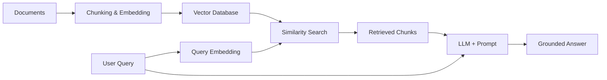

### RAG Components Explained at SE Level

| Component | What It Does | Customer-Friendly Explanation | Key Decision |
|---|---|---|---|
| **Embeddings** | Converts text to numerical vectors that capture meaning | "We convert your documents into a format where similar concepts are grouped together" | Which embedding model? (OpenAI, Cohere, open-source) |
| **Chunking** | Splits documents into retrieval-sized pieces | "We break your documents into digestible pieces so the AI can find the right section" | Chunk size, overlap, strategy (fixed, semantic, document-aware) |
| **Vector Store** | Stores and searches embeddings efficiently | "A specialized database optimized for finding similar content" | Which vector DB? Scale, features, hosting |
| **Retrieval** | Finds the most relevant chunks for a query | "The search step -- finding the right information before the AI answers" | Similarity search, hybrid search, reranking |
| **Generation** | LLM produces an answer using retrieved context | "The AI reads the relevant documents and writes an answer" | Which LLM? Cost, quality, latency tradeoffs |

### Architecture Diagram Template for RAG Proposals

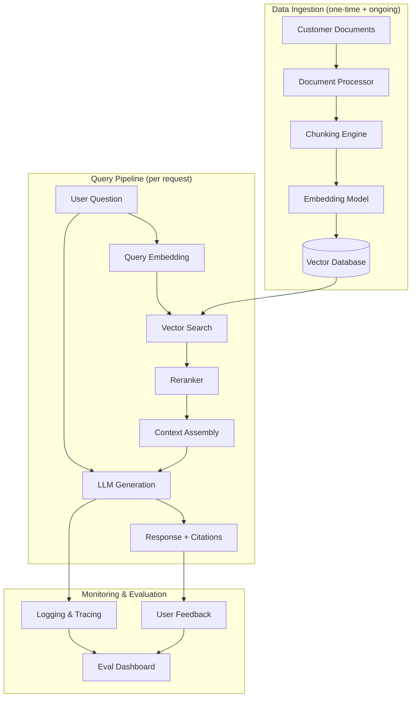

### Common RAG Failure Modes

These are the issues customers will hit. Knowing them before the POC starts makes you credible and prevents surprises.

| Failure Mode | Symptom | Root Cause | How to Discuss with Customer |
|---|---|---|---|
| **Poor retrieval** | AI ignores relevant documents | Bad chunking, wrong embedding model, no reranking | "The search step is not finding the right documents. We need to tune the retrieval pipeline." |
| **Hallucination despite context** | AI makes up facts not in the documents | Context too long, model ignores context, poor prompting | "The AI is not staying grounded. We add guardrails and evaluation to catch this." |
| **Stale data** | Answers based on outdated information | No re-indexing pipeline, no document versioning | "We need an automated pipeline to keep the index current when documents change." |
| **Wrong granularity** | Answers are too vague or too specific | Chunks too large or too small | "We need to adjust how we split documents -- current chunks are [too big/too small] for your queries." |
| **Multi-hop failures** | Cannot answer questions that require reasoning across multiple documents | Single retrieval step, no query decomposition | "This question needs information from multiple documents. We add a query decomposition step." |
| **Cost overrun** | Monthly API bill higher than expected | Too many tokens per query, no caching, over-retrieval | "We optimize by caching common queries, reducing retrieved context, and routing simple queries to cheaper models." |

---

## Agent and Tool-Use Patterns

### When Agents Add Value vs Complexity

Agents are powerful but dangerous to recommend prematurely. An agent that fails unpredictably is worse than a simpler system that works reliably.

| Recommend Agents When | Avoid Agents When |
|---|---|
| The task requires multiple steps with decisions between them | The task is a single step (use a prompt or RAG instead) |
| The user needs to interact with external systems (APIs, databases, tools) | The customer needs deterministic, auditable behavior |
| The workflow varies based on input (routing, branching logic) | The customer has strict compliance requirements and cannot explain AI decisions |
| Human-in-the-loop checkpoints are acceptable | Latency must be sub-second (agents are slow) |
| The customer has engineering capacity to maintain the agent | The customer expects "set it and forget it" |

### Agent Architectures for Customer Scenarios

**Single-Agent (Router Pattern):**
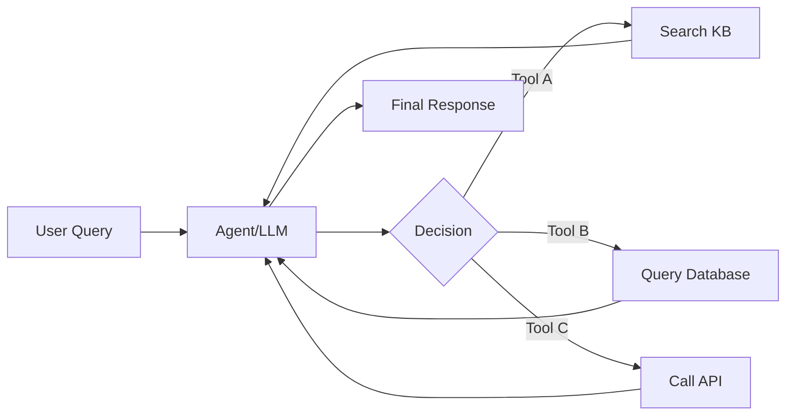

Best for: Customer support automation, simple task routing, single-purpose assistants.

**Multi-Agent (Specialist Pattern):**
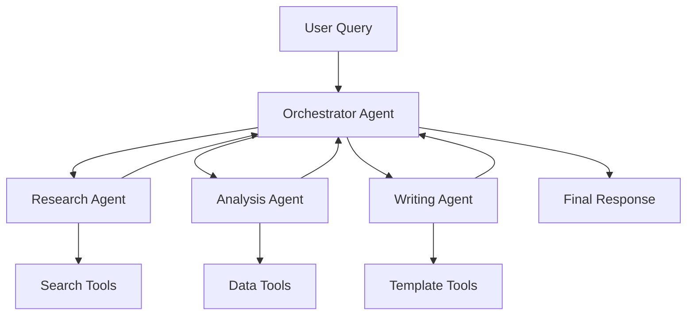

Best for: Complex workflows with distinct phases, document processing pipelines, multi-step analysis.

**Human-in-the-Loop Pattern:**
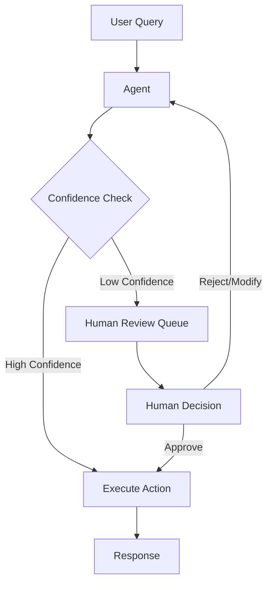

Best for: High-stakes decisions, regulated industries, early deployment when trust is being built.

### Tool Integration

Connecting LLMs to customer systems is where the real value lives and where the real complexity hides.

**Common tool types:**
| Tool Type | Example | Integration Pattern | Risk Level |
|---|---|---|---|
| **Read-only data** | Search knowledge base, query database | Low risk, high value, start here | Low |
| **External API** | Weather, stock prices, CRM lookup | Moderate -- handle auth, rate limits, errors | Medium |
| **Write operations** | Create ticket, send email, update record | High risk -- needs human approval or guardrails | High |
| **Code execution** | Run SQL, execute Python | Very high risk -- sandbox required | Very High |

### MCP (Model Context Protocol)

MCP is an emerging standard for connecting LLMs to external tools and data sources. It standardizes how agents discover, authenticate with, and invoke tools.

**What to tell customers:**
- "MCP is like a USB standard for AI tools -- it defines a common interface so your AI system can plug into any MCP-compatible data source or tool without custom integration code."
- "This reduces integration time from weeks to hours for supported tools, and future-proofs your architecture."

**Cross-reference:** For deep technical agent and tool-use patterns, see `../../llms/04-agents-and-tool-use/`.

---

## LLM Gateway and Orchestration

### API Gateway Patterns

An LLM gateway sits between your application and one or more LLM providers. It handles routing, fallback, rate limiting, logging, and cost control.

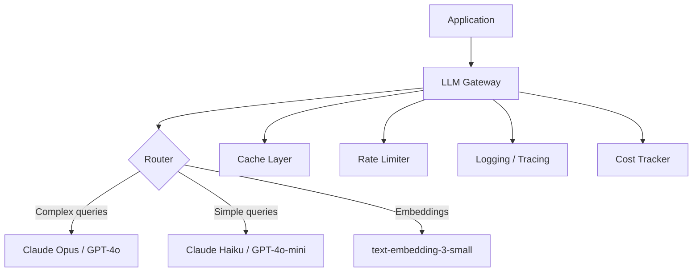

### Multi-Model Strategy

Not every query needs the most capable (and expensive) model. A tiered approach reduces cost by 50-80% with minimal quality loss.

| Tier | Model Class | Use Cases | Cost (approx.) | Latency |
|---|---|---|---|---|
| **Tier 1: Small** | Haiku, GPT-4o-mini, Gemini Flash | Classification, routing, simple extraction, summarization of short texts | $0.25-1.00 / 1M tokens | 50-200ms |
| **Tier 2: Medium** | Sonnet, GPT-4o, Gemini Pro | RAG answer generation, complex extraction, analysis, content generation | $3-15 / 1M tokens | 200-1000ms |
| **Tier 3: Large** | Opus, o1/o3, Gemini Ultra | Complex reasoning, multi-step analysis, code generation, critical decisions | $15-75 / 1M tokens | 1-30s |

**Router logic:**
```
if query is classification or routing:
    use Tier 1
elif query requires factual grounding (RAG):
    use Tier 2
elif query requires complex reasoning or high stakes:
    use Tier 3
else:
    default to Tier 2
```

### Fallback Chains and Graceful Degradation

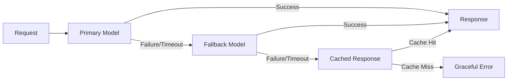

**Fallback strategies:**
| Strategy | How It Works | Best For |
|---|---|---|
| **Model fallback** | Primary model fails, try a different provider | Provider outages, rate limits |
| **Tier fallback** | Primary model too slow, use a faster/cheaper model | Latency-sensitive applications |
| **Cache fallback** | No model available, serve a cached response | Common queries, high-availability requirements |
| **Static fallback** | No cache, return a pre-written response | "I'm unable to process that right now. Please try again." |

### Observability

LLM applications need different observability than traditional software because failures are often semantic (wrong answer) rather than operational (500 error).

| What to Log | Why | How |
|---|---|---|
| Full prompt (input + system prompt) | Debug quality issues, audit for compliance | Structured logging with request ID |
| Full response | Evaluate quality, detect hallucination | Structured logging, linked to prompt |
| Token counts (input, output, cached) | Cost tracking and budgeting | Parse from API response headers |
| Latency (TTFB, total) | Performance monitoring | Timestamp at request/response boundaries |
| Model used | Track which model served which request | Log model ID from API response |
| Retrieved context (for RAG) | Debug retrieval quality | Log document IDs and relevance scores |
| User feedback | Ground truth for evaluation | Thumbs up/down, corrections, escalations |

**Cross-reference:** For production observability patterns, see `../../llms/07-production-systems/`.

---

## Data Pipeline for AI

### Ingestion Pipeline

The data pipeline is the unglamorous but critical foundation of every AI system. Customers who underinvest here will have AI systems that degrade over time.

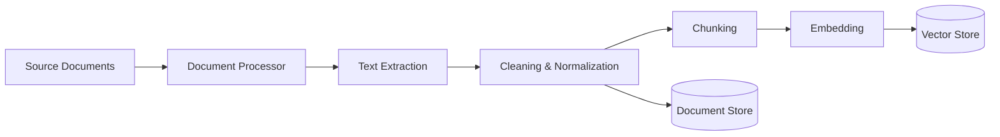

### Document Processing

| Document Type | Extraction Challenge | Recommended Approach |
|---|---|---|
| **PDF** | Layout, tables, images, scanned text | Unstructured.io, LlamaParse, or cloud document AI |
| **Word/DOCX** | Formatting, tracked changes, embedded objects | python-docx + custom post-processing |
| **HTML** | Noise (navigation, ads, boilerplate) | Trafilatura, BeautifulSoup with content extraction |
| **Spreadsheets** | Structure, formulas, multiple sheets | Pandas + schema inference |
| **Email** | Threading, attachments, metadata | Email parsers + attachment extraction pipeline |
| **Confluence/Wiki** | API access, nested pages, macros | API export + HTML processing |
| **Database records** | Schema understanding, joins, context | SQL export with context enrichment |

### Chunking Strategies

| Strategy | How It Works | Best For | Chunk Size |
|---|---|---|---|
| **Fixed-size** | Split every N characters/tokens with overlap | General purpose, simple to implement | 500-1000 tokens, 100-200 overlap |
| **Sentence-based** | Split at sentence boundaries | Short documents, conversational content | 3-5 sentences per chunk |
| **Paragraph-based** | Split at paragraph boundaries | Well-structured documents | 1-3 paragraphs per chunk |
| **Semantic** | Use embedding similarity to find natural breaks | Long documents with varying topics | Dynamic, based on topic shifts |
| **Document-aware** | Respect document structure (headers, sections) | Technical docs, legal contracts, manuals | Section-level chunks with hierarchy metadata |

### What the Customer Needs to Provide vs What You Build

| Customer Provides | You Build |
|---|---|
| Access to source documents or systems | Document extraction and processing pipeline |
| Data schema documentation | Chunking and embedding pipeline |
| Subject matter experts for evaluation | Vector store and retrieval system |
| Sample queries for testing | Query pipeline and LLM integration |
| Feedback mechanism design requirements | Monitoring and evaluation dashboard |
| Compliance and security requirements | Guardrails, access control, audit logging |

---

## Reference Architectures

### 1. Customer Support Automation (RAG + Agent)

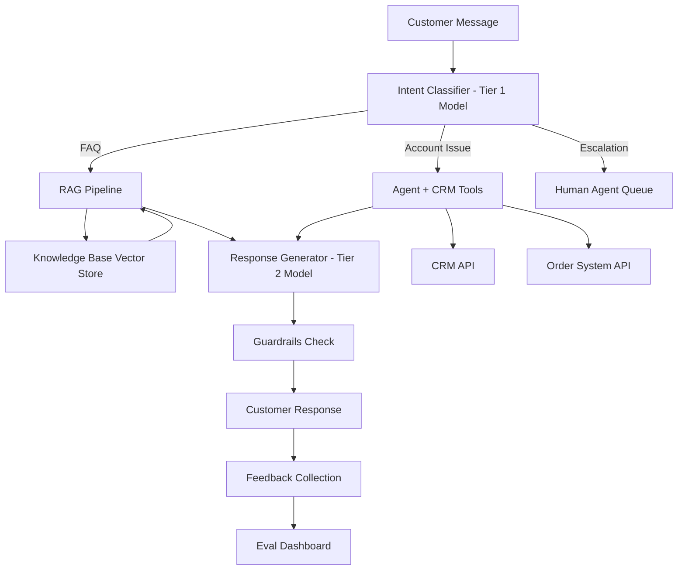

**When to recommend:** Customer has a knowledge base, high ticket volume (>1000/month), and repetitive query patterns.
**Key components:** Intent classifier, RAG pipeline, agent with tool access, guardrails, feedback loop.
**Integration points:** CRM (Salesforce, HubSpot), ticketing (Zendesk, Intercom), knowledge base (Confluence, Notion).
**Timeline estimate:** POC in 3-4 weeks, production in 8-12 weeks.

### 2. Document Processing and Extraction Pipeline

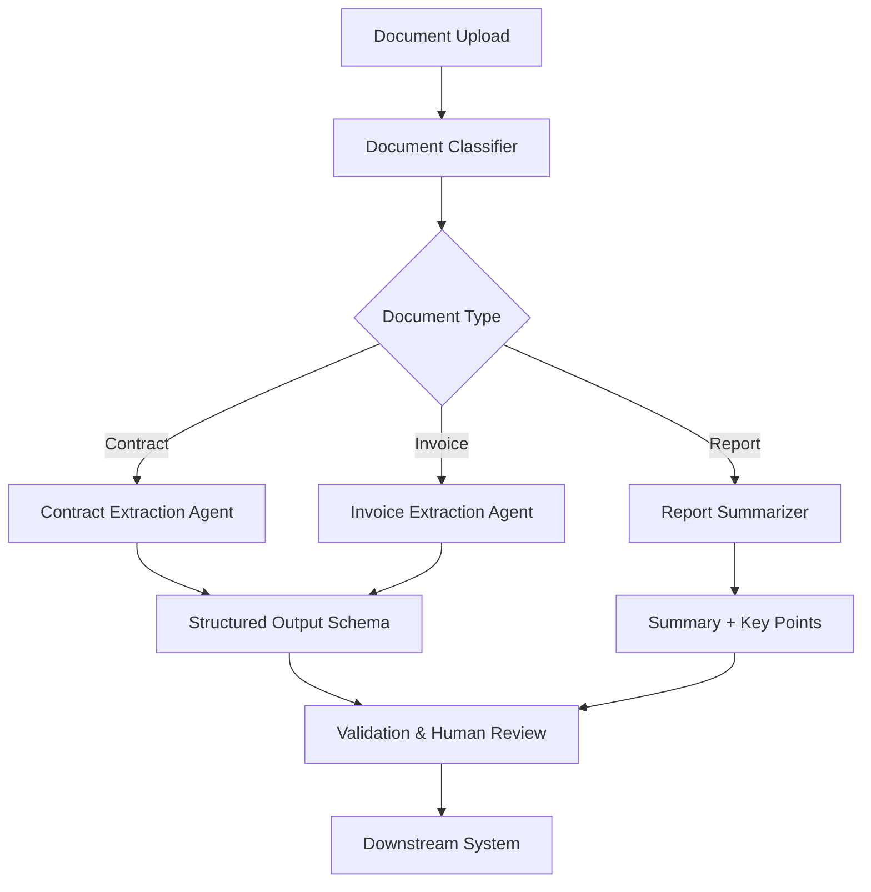

**When to recommend:** Customer processes >500 documents/month manually, needs structured data extraction.
**Key components:** Document classifier, extraction prompts with structured output, validation layer.
**Integration points:** Document management (SharePoint, Google Drive), ERP, databases.
**Timeline estimate:** POC in 2-3 weeks, production in 6-10 weeks.

### 3. Content Generation with Review Workflow

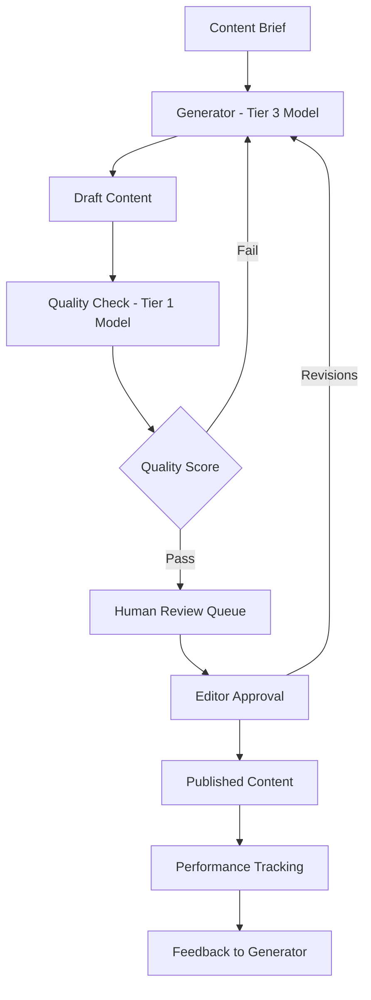

**When to recommend:** Marketing teams, content teams, or agencies producing >50 pieces of content/month.
**Key components:** Generation model, quality checker, review workflow, brand guidelines RAG.
**Integration points:** CMS (WordPress, Contentful), DAM, publishing platforms.
**Timeline estimate:** POC in 2 weeks, production in 4-6 weeks.

### 4. Search and Knowledge Management

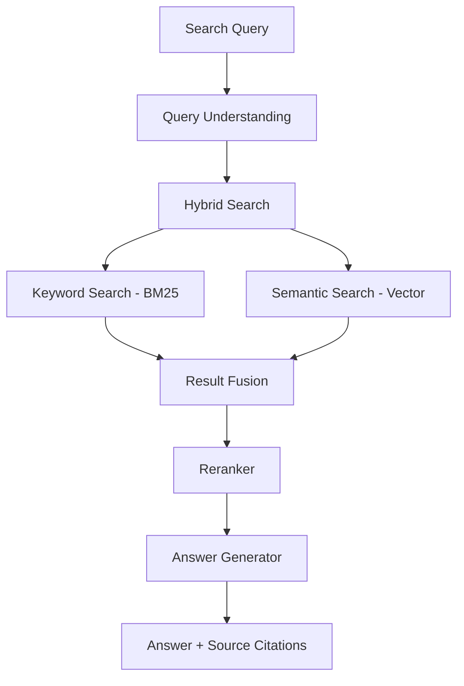

**When to recommend:** Customer has large document corpus (>10K documents), knowledge is scattered, employees waste time searching.
**Key components:** Hybrid search (keyword + semantic), reranking, answer generation with citations.
**Integration points:** Intranet, document stores, wikis, Slack/Teams.
**Timeline estimate:** POC in 3-4 weeks, production in 8-12 weeks.

### 5. Code Assistance and Developer Tools

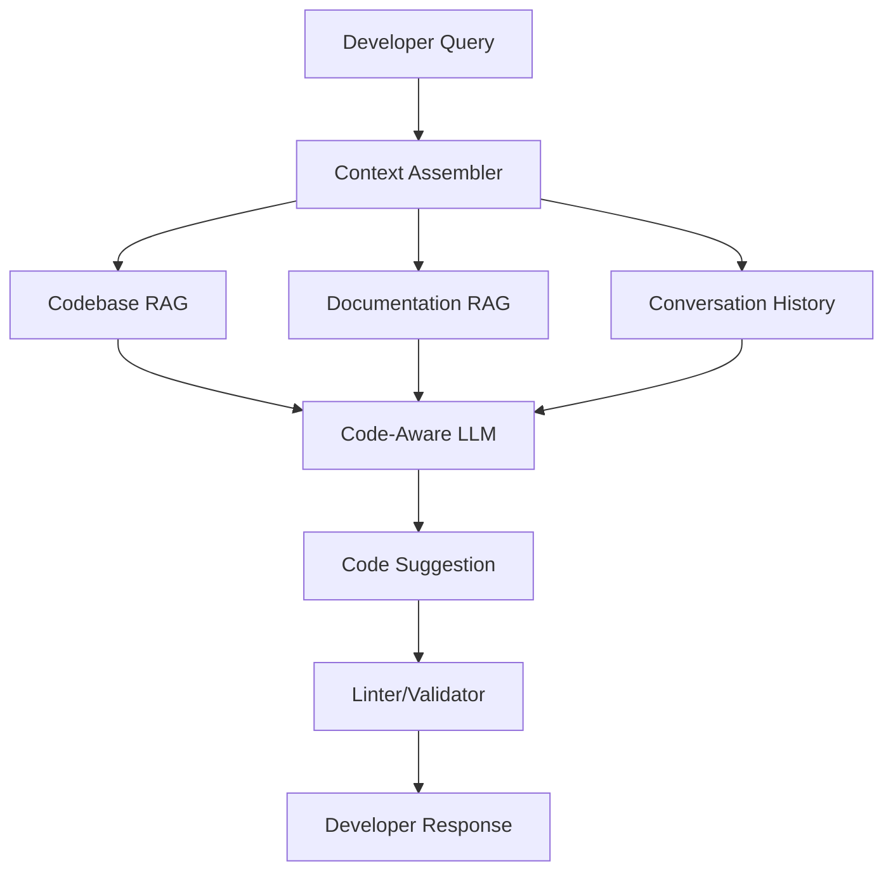

**When to recommend:** Engineering organizations with >50 developers, large codebases, onboarding challenges.
**Key components:** Code-aware embedding, codebase indexing, documentation RAG, code validation.
**Integration points:** IDE (VS Code, JetBrains), Git, CI/CD, documentation platforms.
**Timeline estimate:** POC in 4-6 weeks, production in 10-16 weeks.

---

## Choosing Components

### Foundation Model Selection

| Factor | GPT-4o (OpenAI) | Claude Sonnet/Opus (Anthropic) | Gemini Pro/Ultra (Google) | Open-Source (Llama, Mistral) |
|---|---|---|---|---|
| **Reasoning quality** | Excellent | Excellent (Opus leads on complex tasks) | Very Good | Good (improving rapidly) |
| **Code generation** | Excellent | Excellent | Good | Good (Code Llama, DeepSeek) |
| **Long context** | 128K tokens | 200K tokens | 1M+ tokens | 8K-128K depending on model |
| **Structured output** | Native JSON mode | Native tool use and JSON | Function calling | Varies by model |
| **Cost (per 1M input)** | $2.50-5.00 | $3.00-15.00 | $1.25-5.00 | Infrastructure cost only |
| **Latency** | Fast | Fast (Haiku very fast) | Fast | Depends on infrastructure |
| **Data privacy** | SOC 2, data not used for training (API) | SOC 2, data not used for training | Vertex AI compliance | Full control (self-hosted) |
| **Compliance certs** | SOC 2, HIPAA BAA available | SOC 2, HIPAA BAA available | SOC 2, HIPAA, FedRAMP (Vertex) | Depends on hosting |
| **SE talking point** | "Industry standard, broadest ecosystem" | "Best at following complex instructions, safest" | "Best for large context, Google Cloud integration" | "Full control, no vendor lock-in, data stays local" |

### Vector Database Selection

| Database | Best For | Scale | Key Feature | Operational Overhead |
|---|---|---|---|---|
| **Pinecone** | Quick start, managed service | Billions of vectors | Fully managed, easy API | Very Low |
| **Weaviate** | Hybrid search, multimodal | Millions-billions | Built-in hybrid search, modules | Low-Medium |
| **Qdrant** | Performance, filtering | Millions-billions | Advanced filtering, Rust performance | Low-Medium |
| **pgvector** | Postgres shops, simple RAG | Millions | Uses existing Postgres, familiar ops | Low (existing Postgres) |
| **ChromaDB** | Prototyping, small scale | Thousands-millions | Simple API, embedded mode | Very Low |
| **Elasticsearch** | Existing ES users, hybrid search | Billions | Combine with existing search infra | Medium (existing ES) |

### Orchestration Framework Selection

| Framework | Best For | Tradeoffs | When to Recommend |
|---|---|---|---|
| **LangChain** | Rapid prototyping, broad integrations | Abstractions can be opaque, fast-moving API | Customer wants quick POC with many integrations |
| **LlamaIndex** | Data-heavy RAG, document processing | RAG-focused (less general-purpose agent support) | Customer's primary use case is document Q&A |
| **Custom code** | Production systems, full control | More development time, but cleaner architecture | Customer has engineering team and wants maintainability |
| **Semantic Kernel** | Microsoft/.NET shops | Smaller ecosystem than Python alternatives | Customer is a Microsoft shop with .NET stack |

### Build vs Buy by Component

| Component | Buy When | Build When |
|---|---|---|
| **Foundation model** | Almost always (API providers) | Training from scratch is almost never justified |
| **Embedding model** | Standard use cases, fast start | Domain-specific needs, extreme cost sensitivity |
| **Vector database** | Standard scale, limited ops team | Extreme scale or unique requirements |
| **Orchestration** | POC, small team, standard patterns | Production system, large team, custom requirements |
| **Evaluation** | Never buy a generic eval tool blindly | Always build custom evals -- they are your IP |
| **Guardrails** | Commodity checks (PII, toxicity) | Domain-specific safety checks, custom policies |

---

## Practice Exercises

The following exercises in `exercises.py` directly practice concepts from this file:

- **Exercise 3: RAG Architecture Designer** -- Practices the "RAG" section end-to-end. Takes customer requirements (data types, scale, latency, compliance) and generates a component selection with justification for each choice (embedding model, vector DB, LLM, orchestration layer). Produces a Mermaid diagram string. Reference the component selection tables and architecture diagram templates.

- **Exercise 4: LLM Cost Estimator** -- Applies the "Multi-Model Strategy" and cost concepts from the "LLM Gateway and Orchestration" section. Takes usage projections and computes costs across model tiers with caching and batching optimizations.

See also `examples.py` sections 2 (RAG Architecture Designer) and 3 (Token Cost Calculator) for complete runnable reference implementations.

---

## Interview Q&A: LLM Integration Patterns

**Q: A customer asks you to recommend an architecture for a Q&A system over their internal documents. Walk through your approach.**

I start with discovery questions about the documents: how many, what format, how often they change, and who needs to query them. For most internal Q&A use cases, RAG is the right starting point -- it is faster to deploy than fine-tuning, works with changing data, and does not require labeled training data. The architecture has three layers: an ingestion pipeline that processes documents into an indexed format, a query pipeline that retrieves relevant context and generates answers, and a monitoring layer that tracks quality and cost. For the ingestion side, I choose a document processor based on their formats, a chunking strategy based on document structure, and a vector database based on their scale and operational preferences. For the query side, I recommend hybrid search (keyword + semantic) with a reranker for quality, and a mid-tier model for generation. The key decisions I walk through with the customer are: where to host the vector store, which LLM provider meets their compliance requirements, and how to handle document updates. I always recommend starting with the 100 most-queried documents as a pilot set and measuring retrieval accuracy and answer quality before scaling to the full corpus.

**Q: When would you recommend an agent architecture vs a simpler RAG system?**

RAG is the right default for most knowledge retrieval use cases. I recommend agents when the task inherently requires multiple steps with decisions between them -- for example, a customer support system that needs to look up an account, check order status, and then decide whether to issue a refund. The key distinction is whether the system needs to take actions or just answer questions. If it only needs to answer questions from documents, RAG is simpler, more predictable, and easier to evaluate. If it needs to interact with APIs, make decisions, or orchestrate multi-step workflows, an agent adds real value. I always warn customers about the tradeoffs: agents are harder to debug, harder to evaluate (because behavior varies by path), and more expensive (multiple LLM calls per request). I recommend starting with a single-agent architecture with a small number of well-defined tools, adding human-in-the-loop for any write operations, and only graduating to multi-agent patterns when the single-agent approach hits clear limitations.

**Q: How do you help a customer choose between LLM providers?**

I frame it around four dimensions: capability, cost, compliance, and ecosystem. For capability, I recommend running a head-to-head evaluation on a sample of the customer's actual data -- vendor benchmarks are not representative of domain-specific performance. For cost, I build a token usage projection based on their expected volume and show monthly costs across providers and model tiers, including optimization strategies like caching and tiered routing. For compliance, I map their requirements (data residency, HIPAA, SOC 2, EU AI Act) against each provider's certifications and data handling policies. For ecosystem, I consider their existing cloud provider, developer familiarity, and integration needs. In practice, most enterprise customers end up using multiple providers -- a primary model for core use cases and a fallback for resilience. I advise against hard coupling to any single provider's proprietary features and recommend an LLM gateway pattern that makes switching providers a configuration change, not a code rewrite.
